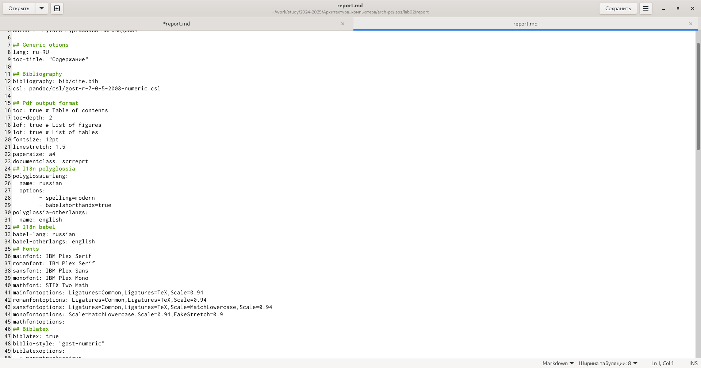
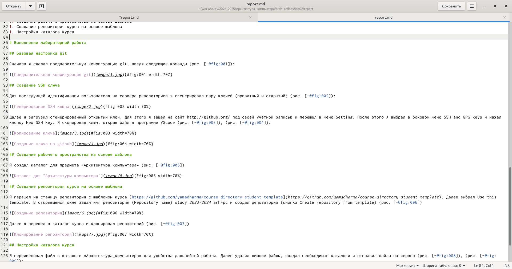

---
## Front matter
title: "Отчет по лабораторной работе №2"
subtitle: "дисциплина: Архитектура компьютера"
author: "Мутаев Муртазаали Магомедович"

## Generic otions
lang: ru-RU
toc-title: "Содержание"

## Bibliography
bibliography: bib/cite.bib
csl: pandoc/csl/gost-r-7-0-5-2008-numeric.csl

## Pdf output format
toc: true # Table of contents
toc-depth: 2
lof: true # List of figures
lot: true # List of tables
fontsize: 12pt
linestretch: 1.5
papersize: a4
documentclass: scrreprt
## I18n polyglossia
polyglossia-lang:
  name: russian
  options:
	- spelling=modern
	- babelshorthands=true
polyglossia-otherlangs:
  name: english
## I18n babel
babel-lang: russian
babel-otherlangs: english
## Fonts
mainfont: IBM Plex Serif
romanfont: IBM Plex Serif
sansfont: IBM Plex Sans
monofont: IBM Plex Mono
mathfont: STIX Two Math
mainfontoptions: Ligatures=Common,Ligatures=TeX,Scale=0.94
romanfontoptions: Ligatures=Common,Ligatures=TeX,Scale=0.94
sansfontoptions: Ligatures=Common,Ligatures=TeX,Scale=MatchLowercase,Scale=0.94
monofontoptions: Scale=MatchLowercase,Scale=0.94,FakeStretch=0.9
mathfontoptions:
## Biblatex
biblatex: true
biblio-style: "gost-numeric"
biblatexoptions:
  - parentracker=true
  - backend=biber
  - hyperref=auto
  - language=auto
  - autolang=other*
  - citestyle=gost-numeric
## Pandoc-crossref LaTeX customization
figureTitle: "Рис."
tableTitle: "Таблица"
listingTitle: "Листинг"
lofTitle: "Список иллюстраций"
lotTitle: "Список таблиц"
lolTitle: "Листинги"
## Misc options
indent: true
header-includes:
  - \usepackage{indentfirst}
  - \usepackage{float} # keep figures where there are in the text
  - \floatplacement{figure}{H} # keep figures where there are in the text
---

# Цель работы

Целью работы является освоение процедуры оформления отчетов с помощью легковесного языка разметки Markdown.

# Задание

1. Создать отчет по лабораторной работе № 2 в markdown
1. Загрузить результат на Github

# Выполнение лабораторной работы

Я открыл терминал, перешел в каталог курса, сформированного при выполнении лабораторной работы №2 и обновил локальный репозиторий, скачав изменения из удаленного репозитория с помощью команды *git pull*. 

Далее я открыл файл report.md и начал делать отчет по лабораторной работе №2.

{#fig:001 width=70%}

В файле уже присутствовал шаблон отчета, мне оставалось лишь немного отредактировать текст, что я и сделал:

{#fig:002 width=70%}

Далее я загрузил файлы на github с помощью следующих команд:

*cd ~/work/study/2023-2024/"Архитектура компьютера"/arch-pc*

*git add .*

*git commit -am 'feat(main): add files lab-3'*

*git push*

# Выводы

По выполнении этой лабораторной работы я освоил процедуры оформления отчетов с помощью легковесногоязыка разметки Markdown.
