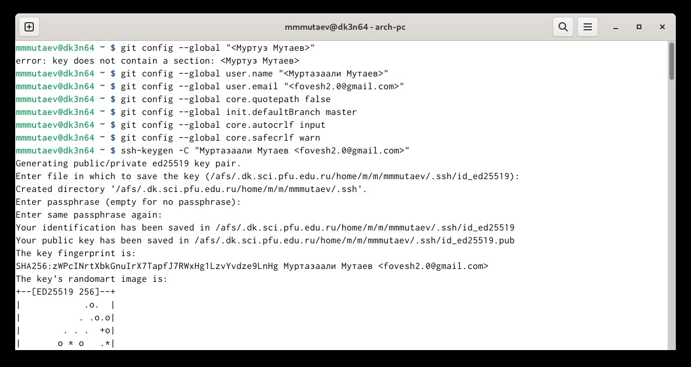
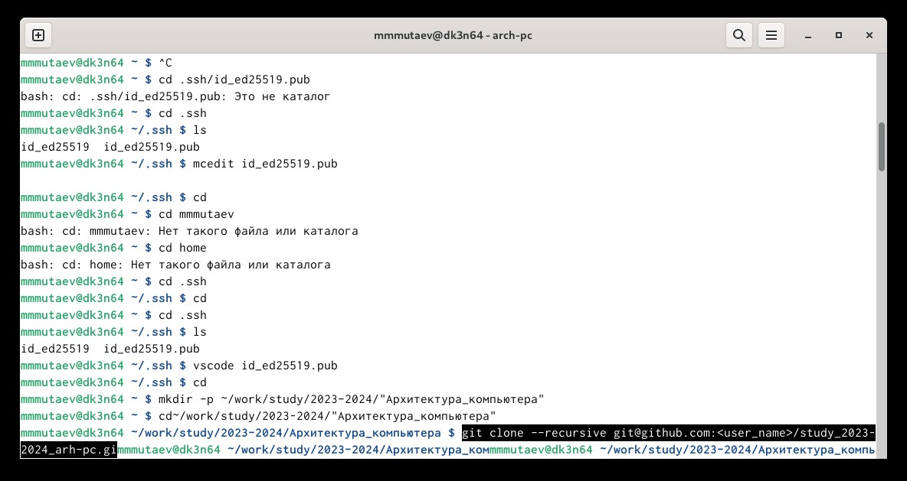
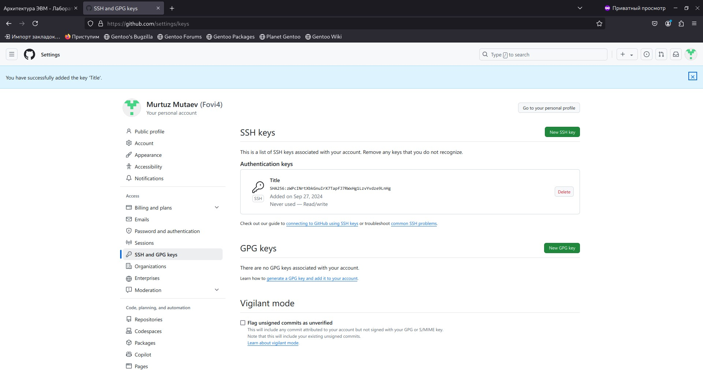
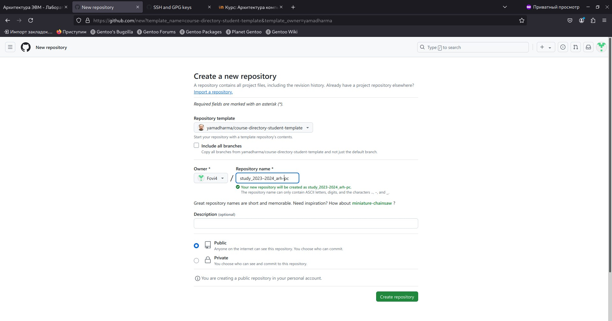
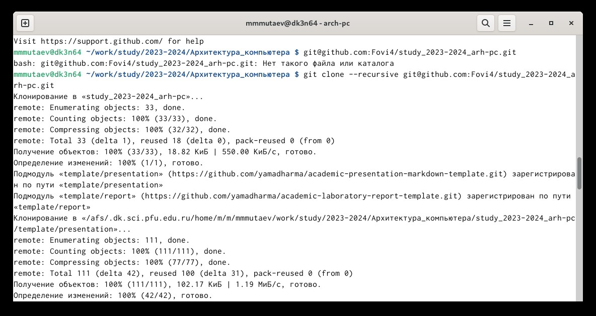
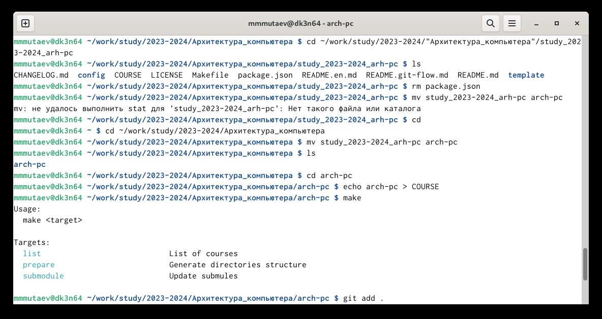
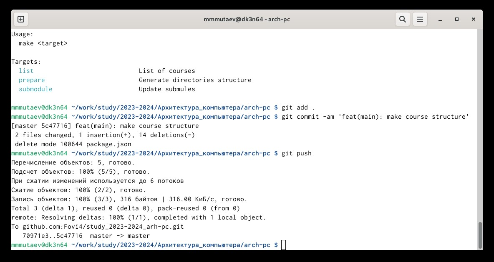

---
## Front matter
title: "Отчет по лабораторной работе №2"
subtitle: "дисциплина: Архитектура компьютера"
author: "Мутаев Муртазаали Магомедович"

## Generic otions
lang: ru-RU
toc-title: "Содержание"

## Bibliography
bibliography: bib/cite.bib
csl: pandoc/csl/gost-r-7-0-5-2008-numeric.csl

## Pdf output format
toc: true # Table of contents
toc-depth: 2
lof: true # List of figures
lot: true # List of tables
fontsize: 12pt
linestretch: 1.5
papersize: a4
documentclass: scrreprt
## I18n polyglossia
polyglossia-lang:
  name: russian
  options:
	- spelling=modern
	- babelshorthands=true
polyglossia-otherlangs:
  name: english
## I18n babel
babel-lang: russian
babel-otherlangs: english
## Fonts
mainfont: IBM Plex Serif
romanfont: IBM Plex Serif
sansfont: IBM Plex Sans
monofont: IBM Plex Mono
mathfont: STIX Two Math
mainfontoptions: Ligatures=Common,Ligatures=TeX,Scale=0.94
romanfontoptions: Ligatures=Common,Ligatures=TeX,Scale=0.94
sansfontoptions: Ligatures=Common,Ligatures=TeX,Scale=MatchLowercase,Scale=0.94
monofontoptions: Scale=MatchLowercase,Scale=0.94,FakeStretch=0.9
mathfontoptions:
## Biblatex
biblatex: true
biblio-style: "gost-numeric"
biblatexoptions:
  - parentracker=true
  - backend=biber
  - hyperref=auto
  - language=auto
  - autolang=other*
  - citestyle=gost-numeric
## Pandoc-crossref LaTeX customization
figureTitle: "Рис."
tableTitle: "Таблица"
listingTitle: "Листинг"
lofTitle: "Список иллюстраций"
lotTitle: "Список таблиц"
lolTitle: "Листинги"
## Misc options
indent: true
header-includes:
  - \usepackage{indentfirst}
  - \usepackage{float} # keep figures where there are in the text
  - \floatplacement{figure}{H} # keep figures where there are in the text
---

# Цель работы

Целью работы является изучить идеологию и применение средств
контроля версий и приобретение практических навыков по работе с системой
git.

# Задание

1. Базовая настройка git
1. Создание SSH ключа
1. Создание рабочего пространства на основе шаблона
1. Создание репозитория курса на основе шаблона
1. Настройка каталога курса

# Выполнение лабораторной работы

## Базовая настройка git

Сначала я сделал предварительную конфигурацию git, введя следующие команды (рис. [-@fig:001]):

{#fig:001 width=70%}

## Создание SSH ключа

Для последующей идентификации пользователя на сервере репозиториев я сгенерировал пару ключей (приватный и открытый) (рис. [-@fig:002]):

{#fig:002 width=70%}

Далее я загрузил сгенерированный открытый ключ. Для этого я зашел на сайт http://github.org/ под своей учётной записью и перешел в меню Setting. После этого я выбрал в боковом меню SSH and GPG keys и нажал кнопку New SSH key. Я скопировал ключ, открыв файл в программе VScode (рис. [-@fig:003], [-@fig:004]).

{#fig:003 width=70%}
{#fig:004 width=70%}

##Создание рабочего пространства на основе шаблона

Я создал каталог для предмета «Архитектура компьютера» (рис. [-@fig:005])

{#fig:005 width=70%}

## Создание репозитория курса на основе шаблона

Я перешел на станицу репозитория с шаблоном курса [https://github.com/yamadharma/course-directory-student-template](https://github.com/yamadharma/course-directory-student-template). Далее выбрал Use this template. В открывшемся окне задал имя репозитория (Repository name) study_2023–2024_arh-pc и создал репозиторий (кнопка Create repository from template) (рис. [-@fig:006])

{#fig:006 width=70%}

Далее я перешел в каталог курса и клонировал репозиторий (рис. [-@fig:007])

{#fig:007 width=70%}

## Настройка каталога курса

Я переименовал файл в каталоге «Архитектура_компьютера» для удобства дальнейшей работы. Далее удалил лишние файлы, создал необходимые каталоги и отправил файлы на сервер (рис. [-@fig:008], [-@fig:009]):

{#fig:008 width=70%}

{#fig:009 width=70%}

# Выводы

По выполнении этой лабораторной работы я изучил идеологию и применение средств контроля версий и приобрел практические навыки по работе с системой git.
