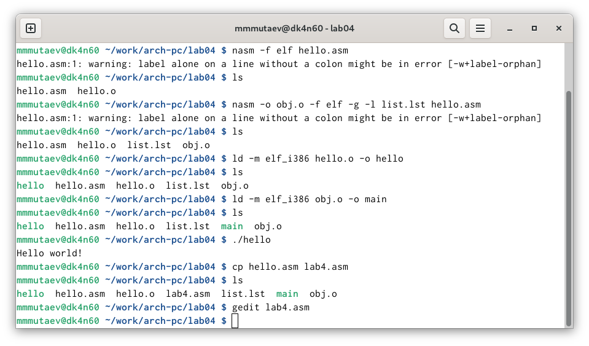
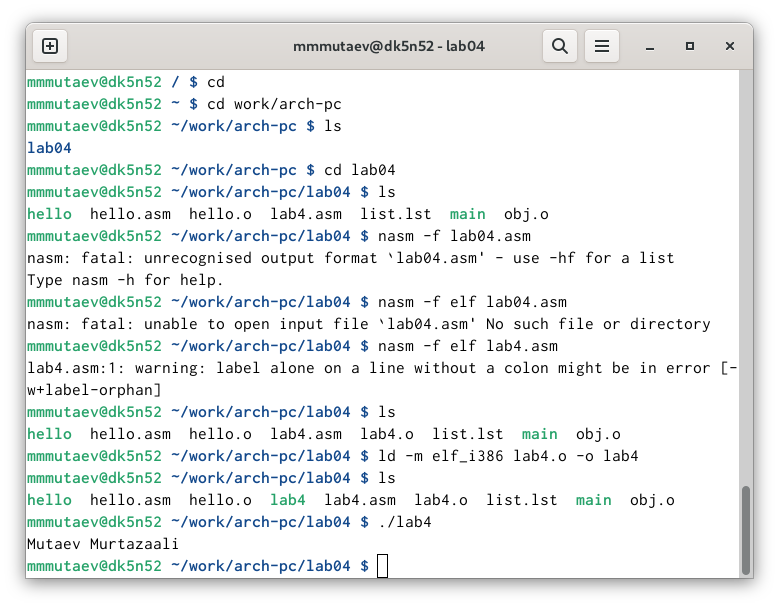

---
## Front matter
title: "Отчёт о лабораторной работе №4"
subtitle: "дисциплина: Архитектура компьютера"
author: "Мутаев Муртазаали Магомедович"

## Generic otions
lang: ru-RU
toc-title: "Содержание"

## Bibliography
bibliography: bib/cite.bib
csl: pandoc/csl/gost-r-7-0-5-2008-numeric.csl

## Pdf output format
toc: true # Table of contents
toc-depth: 2
lof: true # List of figures
lot: true # List of tables
fontsize: 12pt
linestretch: 1.5
papersize: a4
documentclass: scrreprt
## I18n polyglossia
polyglossia-lang:
  name: russian
  options:
	- spelling=modern
	- babelshorthands=true
polyglossia-otherlangs:
  name: english
## I18n babel
babel-lang: russian
babel-otherlangs: english
## Fonts
mainfont: IBM Plex Serif
romanfont: IBM Plex Serif
sansfont: IBM Plex Sans
monofont: IBM Plex Mono
mathfont: STIX Two Math
mainfontoptions: Ligatures=Common,Ligatures=TeX,Scale=0.94
romanfontoptions: Ligatures=Common,Ligatures=TeX,Scale=0.94
sansfontoptions: Ligatures=Common,Ligatures=TeX,Scale=MatchLowercase,Scale=0.94
monofontoptions: Scale=MatchLowercase,Scale=0.94,FakeStretch=0.9
mathfontoptions:
## Biblatex
biblatex: true
biblio-style: "gost-numeric"
biblatexoptions:
  - parentracker=true
  - backend=biber
  - hyperref=auto
  - language=auto
  - autolang=other*
  - citestyle=gost-numeric
## Pandoc-crossref LaTeX customization
figureTitle: "Рис."
tableTitle: "Таблица"
listingTitle: "Листинг"
lofTitle: "Список иллюстраций"
lotTitle: "Список таблиц"
lolTitle: "Листинги"
## Misc options
indent: true
header-includes:
  - \usepackage{indentfirst}
  - \usepackage{float} # keep figures where there are in the text
  - \floatplacement{figure}{H} # keep figures where there are in the text
---

# Цель работы

Освоение процедуры компиляции и сборки программ, написанных на ассемблере NASM.

# Задание

1. Мой первый Hello world!
1. Создание файла
1. Трансляция NASM
1. Компановка LD
1. Запуск программы
1. Самостоятельная работа

# Выполнение лабораторной работы

## Мой первый Hellp world!

### Создание файла

Первым делом я создал файл *hello.asm*, а далее ввел туда следующую программу:

*hello.asm*
*SECTION .data 				; Начало секции данных*
	*hello: DB 'Hello world!',10 	; 'Hello world!' плюс*
	*helloLen: EQU $-hello 		; Длина строки hello*
*SECTION .text 				; Начало секции кода*
	*GLOBAL _start*
*_start: 				; Точка входа в программу*
	*mov eax,4 			; Системный вызов для записи (sys_write)*
	*mov ebx,1 			; Описатель файла '1' - стандартный вывод*
	*mov ecx,hello 			; Адрес строки hello в ecx*
	*mov edx,helloLen 		; Размер строки hello*
	*int 80h 			; Вызов ядра*
	*mov eax,1 			; Системный вызов для выхода (sys_exit)*
	*mov ebx,0 			; Выход с кодом возврата '0' (без ошибок)*
	*int 80h 			; Вызов ядра*

### Трансляция NASM

Далее мне нужно было скомпилировать текст программы в объектный код. Для этого я воспользовался программой nasm:

*nasm -f elf hello.asm*

После этого у меня появился файл *hello.o*

### Компановка LD

Далее, чтобы получить исполняемую программу, объектный файл необходимо передать на обработку компоновщику:

*d -m elf_i386 hello.o -o hello*

После выполнения этой программы в папке появился файл *hello*

### Запуск программы

Наконец-то время пришло к запуску программы. Я это сделал, набрав команду *./hello* (рис. [-@fig:001])

{#fig:001 width=70%}

## Самостоятельная работа

Я скопировал файл *hello.asm* и переименовал его в *lab4.asm*. После этого я его отредактировал таким образом, чтоб программа выводила мою фамилию и имя вместо "Hello world!"

Далее прошел те же этапы, что и в первый раз: трансляция, компановка. После этого запустил программу: (рис. [-@fig:002])

{#fig:002 width=70%}

О чудо! Программа вывела мою фамилию и имя. После выполненой работы я скопировал файлы *hello.asm* и *lab4.asm* в папку *lab04/report* и загрузил все файлы на GitHub.

# Выводы

Выполнив эту лабораторную работу, я освоил процедуры компиляции и сборки программ, написанных на ассемблере NASM.

