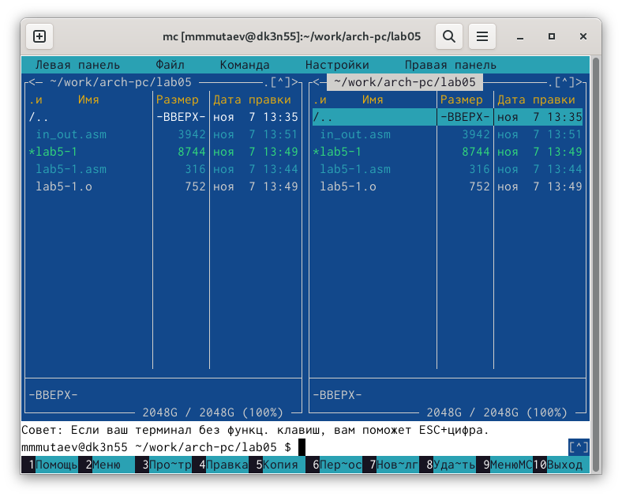
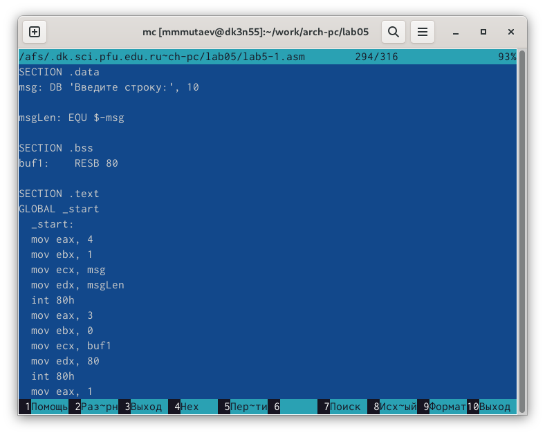
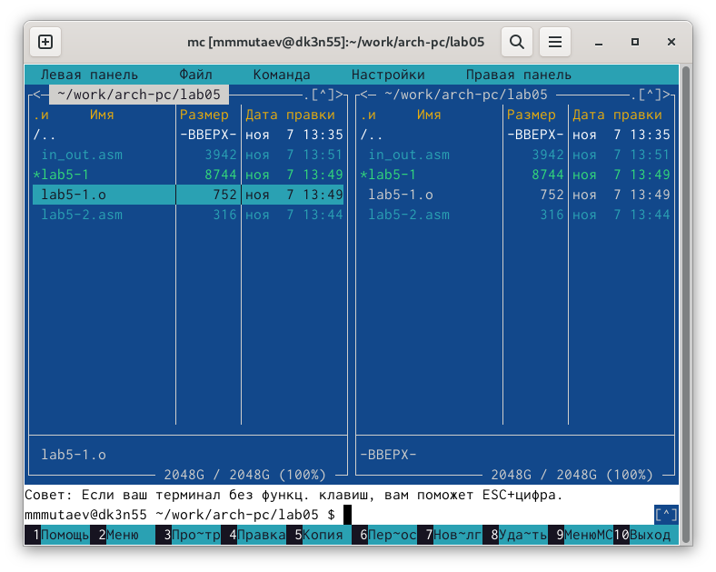
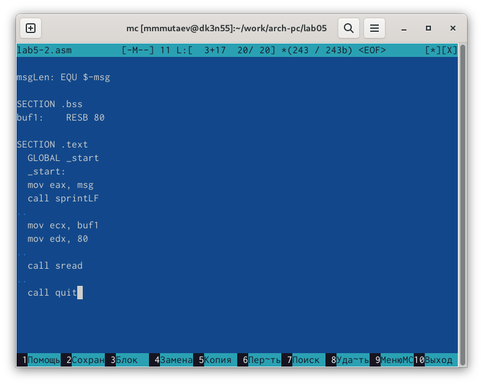
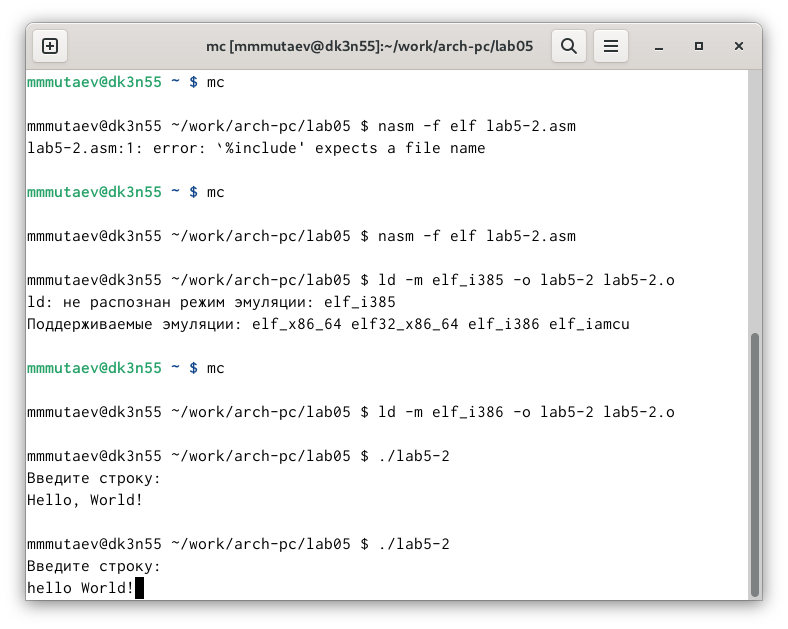
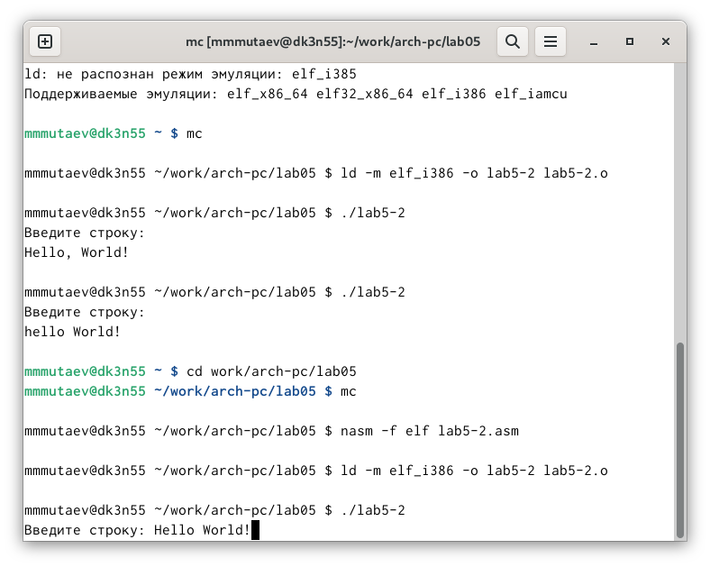
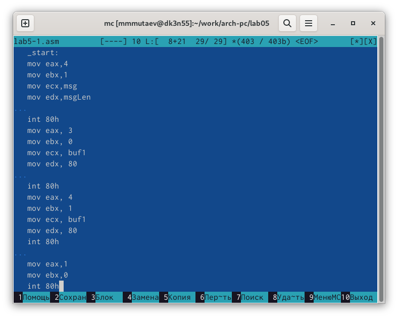
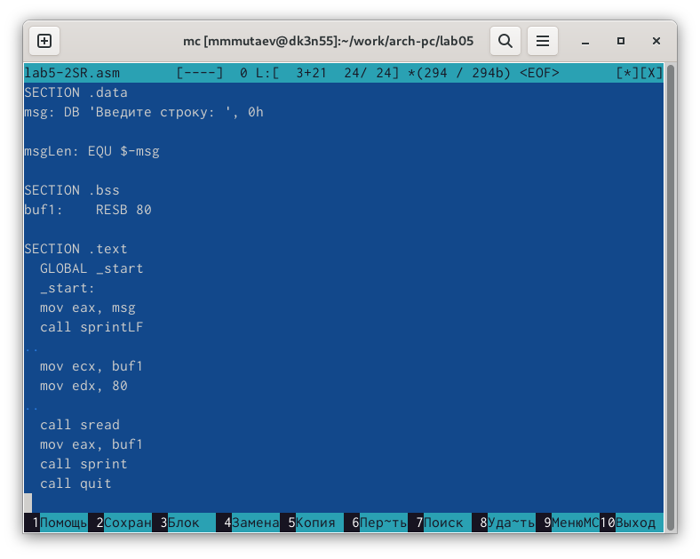
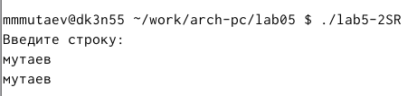

---
## Front matter
title: "Отчёт по лабораторной работе №5"
subtitle: "Дисциплина: Архитектура компьютера"
author: "Мутаев Муртазаали Магомедович"

## Generic otions
lang: ru-RU
toc-title: "Содержание"

## Bibliography
bibliography: bib/cite.bib
csl: pandoc/csl/gost-r-7-0-5-2008-numeric.csl

## Pdf output format
toc: true # Table of contents
toc-depth: 2
lof: true # List of figures
lot: true # List of tables
fontsize: 12pt
linestretch: 1.5
papersize: a4
documentclass: scrreprt
## I18n polyglossia
polyglossia-lang:
  name: russian
  options:
	- spelling=modern
	- babelshorthands=true
polyglossia-otherlangs:
  name: english
## I18n babel
babel-lang: russian
babel-otherlangs: english
## Fonts
mainfont: IBM Plex Serif
romanfont: IBM Plex Serif
sansfont: IBM Plex Sans
monofont: IBM Plex Mono
mathfont: STIX Two Math
mainfontoptions: Ligatures=Common,Ligatures=TeX,Scale=0.94
romanfontoptions: Ligatures=Common,Ligatures=TeX,Scale=0.94
sansfontoptions: Ligatures=Common,Ligatures=TeX,Scale=MatchLowercase,Scale=0.94
monofontoptions: Scale=MatchLowercase,Scale=0.94,FakeStretch=0.9
mathfontoptions:
## Biblatex
biblatex: true
biblio-style: "gost-numeric"
biblatexoptions:
  - parentracker=true
  - backend=biber
  - hyperref=auto
  - language=auto
  - autolang=other*
  - citestyle=gost-numeric
## Pandoc-crossref LaTeX customization
figureTitle: "Рис."
tableTitle: "Таблица"
listingTitle: "Листинг"
lofTitle: "Список иллюстраций"
lotTitle: "Список таблиц"
lolTitle: "Листинги"
## Misc options
indent: true
header-includes:
  - \usepackage{indentfirst}
  - \usepackage{float} # keep figures where there are in the text
  - \floatplacement{figure}{H} # keep figures where there are in the text
---

# Цель работы

Приобретение практических навыков работы в Midnight Commander. Освоение инструкций языка ассемблера mov и int.

# Задание

1. Работа в Midnight Commander
1. Подключение внешнего файла in_out.asm
1. Задания для самостоятельной работы

# Выполнение лабораторной работы

## Работа в Midnight Commander

Первым делом я открыл Midnight Commander и создал в каталоге *work/arch-pc/lab05* файл *lab5-1.asm* (рис. [-@fig:001]).

{#fig:001 width=70%}

Далее я открыл его с помощью клавиши F4 и ввел туда код из методички (рис. [-@fig:002]).

{#fig:002 width=70%}

Затем создал исполняемый файл и запустил программу. Мне выдало такой результат (рис. [-@fig:003]):

:

{#fig:004 width=70%}

Далее я вставил в файл код из методички, подключив скачаный файл (рис. [-@fig:005]):

{#fig:005 width=70%}

Опять же, создал исполняемый файл, запустил программу и вот, что мне выдало (рис. [-@fig:006]):

{#fig:006 width=70%}

Так же, как и в первый раз, программа ожидала ввода текста.

После этого я заменил sprintLF на sprint, и вот, что мне выдало (рис. [-@fig:007]):

{#fig:007 width=70%}

В отличие от первой программа, эта давала мне вписать текст с клавиатуры на той же строчке, что и выведенный текст.

## Задания для самостоятельной работы

Передо мной стояла задача изменить 2 вышесделанные программы таким образом, чтоб они выводили на экран то, что я введу с клавиатуры. Ну я это и сделал. Вот первая программа (рис. [-@fig:008]):

{#fig:008 width=70%}

Я вставил код вывода текста на экран и заменил msg на buf1 (рис. [-@fig:009]):

{#fig:009 width=70%}

Вот вторая (рис. [-@fig:010]):

{#fig:010 width=70%}

Я также скопировал код вывода текста и заменил msg на buf1, после чего вывел текст с помощью команды sprint (рис. [-@fig:011]):

{#fig:011 width=70%}

# Выводы

Я приобрел практические навыки работы в Midnight Commander и освоил инструкции языка ассемблера mov и int.

