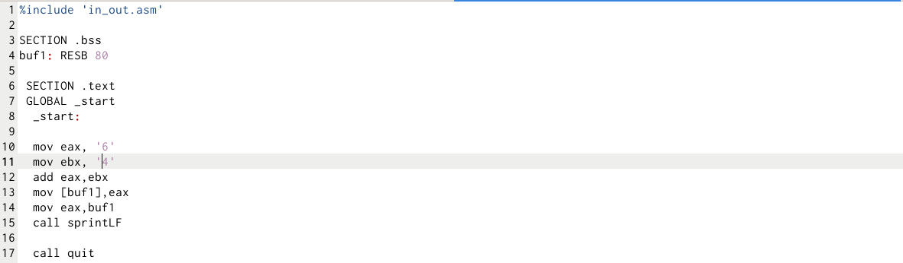
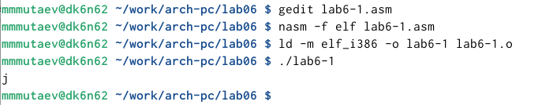
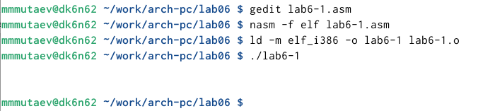
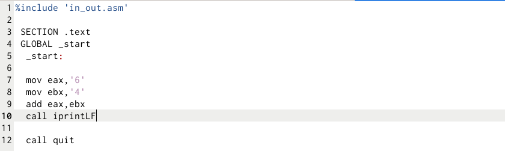
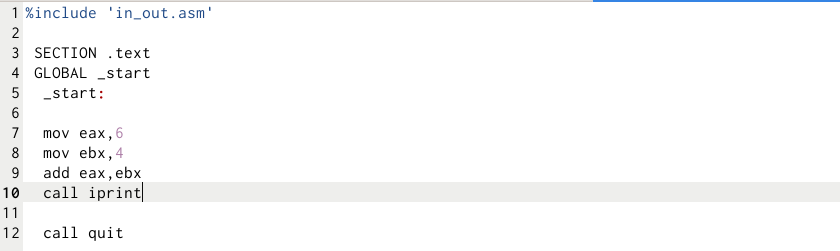
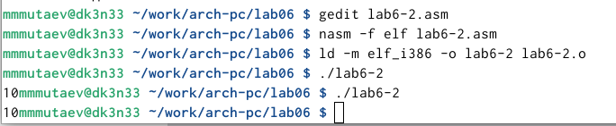
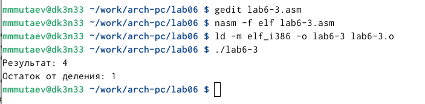
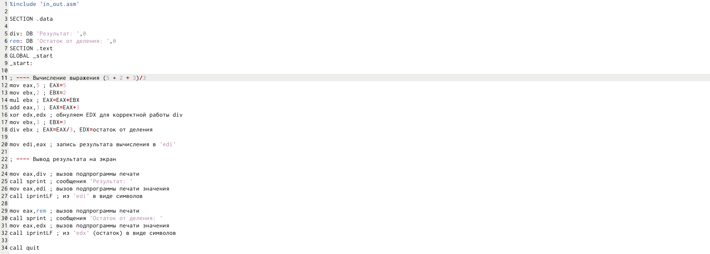

---
## Front matter
title: "Отчет по лабораторной работе №6"
subtitle: "Дисциплина: Архитектура компьютера"
author: "Мутаев Муртазаали Магомедович"

## Generic otions
lang: ru-RU
toc-title: "Содержание"

## Bibliography
bibliography: bib/cite.bib
csl: pandoc/csl/gost-r-7-0-5-2008-numeric.csl

## Pdf output format
toc: true # Table of contents
toc-depth: 2
lof: true # List of figures
lot: true # List of tables
fontsize: 12pt
linestretch: 1.5
papersize: a4
documentclass: scrreprt
## I18n polyglossia
polyglossia-lang:
  name: russian
  options:
	- spelling=modern
	- babelshorthands=true
polyglossia-otherlangs:
  name: english
## I18n babel
babel-lang: russian
babel-otherlangs: english
## Fonts
mainfont: IBM Plex Serif
romanfont: IBM Plex Serif
sansfont: IBM Plex Sans
monofont: IBM Plex Mono
mathfont: STIX Two Math
mainfontoptions: Ligatures=Common,Ligatures=TeX,Scale=0.94
romanfontoptions: Ligatures=Common,Ligatures=TeX,Scale=0.94
sansfontoptions: Ligatures=Common,Ligatures=TeX,Scale=MatchLowercase,Scale=0.94
monofontoptions: Scale=MatchLowercase,Scale=0.94,FakeStretch=0.9
mathfontoptions:
## Biblatex
biblatex: true
biblio-style: "gost-numeric"
biblatexoptions:
  - parentracker=true
  - backend=biber
  - hyperref=auto
  - language=auto
  - autolang=other*
  - citestyle=gost-numeric
## Pandoc-crossref LaTeX customization
figureTitle: "Рис."
tableTitle: "Таблица"
listingTitle: "Листинг"
lofTitle: "Список иллюстраций"
lotTitle: "Список таблиц"
lolTitle: "Листинги"
## Misc options
indent: true
header-includes:
  - \usepackage{indentfirst}
  - \usepackage{float} # keep figures where there are in the text
  - \floatplacement{figure}{H} # keep figures where there are in the text
---

# Цель работы

Освоение арифметических инструкция языка ассемблера NASM.

# Задание

1. Листинг 1
1. Листинг 2
1. Листинг 3
1. Ответы на вопросы
1. Задания для самостоятельной работы

# Выполнение лабораторной работы

## Листинг 1

Я создал файл lab6-1.asm в каталоге work/arch-pc/lab06, и в этот файл вставил код из Листинга 6.1 (рис. [-@fig:001]):

{#fig:001 width=70%}

Запустил программу и получил такой результат (рис. [-@fig:002]):

{#fig:002 width=70%}

Затем изменяю текст программы и вместосимволов записываю в регистры числа и у меня выводится пустые символы, тк по таблице ASCII код 10 - пустной символ, наша программа вывела именно 10 код (рис. [-@fig:003]):

{#fig:003 width=70%}

Затем я создаю файл lab6-2.asm, ввожу текст из листинга и запускаю файл в работу: (рис. [-@fig:004]):

{#fig:004 width=70%}

При исполнении этой программы я получил число 10, в этом мне помогла строчка iprintLF. Она выводит числа а не символы (рис. [-@fig:005]):

{#fig:005 width=70%}

Однако, если поменять текст программы и вместо iprintLF написать iprint, то у нас так же будет выведено число, но без переход на следующую строчку (рис. [-@fig:006]):

{#fig:006 width=70%}

получится вот так: (рис. [-@fig:007]):

{#fig:007 width=70%}

теперь я ввожу программу из листинга и запускаю: (рис. [-@fig:009]):

{#fig:009 width=70%}

А теперь изменяю текст программы для вычисления другого выражения следующим образом: (рис. [-@fig:010]):

{#fig:010 width=70%}

##Задания для самостоятельной работы 

# Выводы

Я освоил арифметические инструкции языка ассемблера NASM.

# Список литературы{.unnumbered}

::: {#refs}
:::
