---
## Front matter
title: "Лабораторная работа №7"
subtitle: "Дисциплина: Архитектура компьютера"
author: "Мутаев Муртазаали Магомедович"

## Generic otions
lang: ru-RU
toc-title: "Содержание"

## Bibliography
bibliography: bib/cite.bib
csl: pandoc/csl/gost-r-7-0-5-2008-numeric.csl

## Pdf output format
toc: true # Table of contents
toc-depth: 2
lof: true # List of figures
lot: true # List of tables
fontsize: 12pt
linestretch: 1.5
papersize: a4
documentclass: scrreprt
## I18n polyglossia
polyglossia-lang:
  name: russian
  options:
	- spelling=modern
	- babelshorthands=true
polyglossia-otherlangs:
  name: english
## I18n babel
babel-lang: russian
babel-otherlangs: english
## Fonts
mainfont: IBM Plex Serif
romanfont: IBM Plex Serif
sansfont: IBM Plex Sans
monofont: IBM Plex Mono
mathfont: STIX Two Math
mainfontoptions: Ligatures=Common,Ligatures=TeX,Scale=0.94
romanfontoptions: Ligatures=Common,Ligatures=TeX,Scale=0.94
sansfontoptions: Ligatures=Common,Ligatures=TeX,Scale=MatchLowercase,Scale=0.94
monofontoptions: Scale=MatchLowercase,Scale=0.94,FakeStretch=0.9
mathfontoptions:
## Biblatex
biblatex: true
biblio-style: "gost-numeric"
biblatexoptions:
  - parentracker=true
  - backend=biber
  - hyperref=auto
  - language=auto
  - autolang=other*
  - citestyle=gost-numeric
## Pandoc-crossref LaTeX customization
figureTitle: "Рис."
tableTitle: "Таблица"
listingTitle: "Листинг"
lofTitle: "Список иллюстраций"
lotTitle: "Список таблиц"
lolTitle: "Листинги"
## Misc options
indent: true
header-includes:
  - \usepackage{indentfirst}
  - \usepackage{float} # keep figures where there are in the text
  - \floatplacement{figure}{H} # keep figures where there are in the text
---

# Цель работы

Изучение команд условного и безусловного переходов. Приобретение навыков написания программ с использованием переходов. Знакомство с назначением и структурой файла листинга

# Задание

1. Знакомство с неусловным переходом
1. Знакомство с условным переходом
1. Файлы листинга
1. Задания для самостоятельной работы

# Выполнение лабораторной работы

## Знакомство с неусловным переходом

Первым делом я создал папку файл lab7-1.asm в каталоге work/arch-pc/lab07. В этот файл я вставил код из методички. (рис. [-@fig:001]).

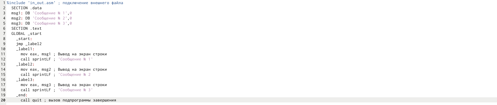{#fig:001 width=70%}

Далее я создал исполняемый файл и запустил программу. Вот результат, который она мне выдала (рис. [-@fig:002]).

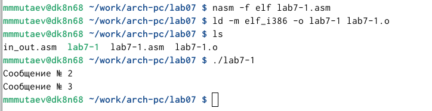{#fig:002 width=70%}

После, чуть отредактировав код, чтобы "прыгнуть" назад по программе, я получил следующий результат (рис. [-@fig:004]).

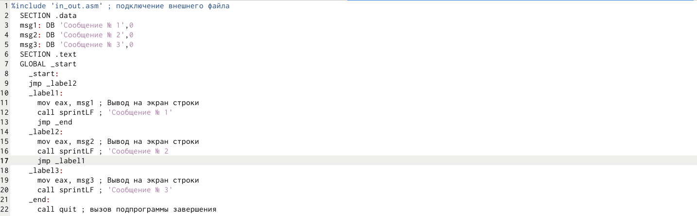{#fig:003 width=70%}

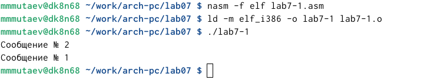{#fig:004 width=70%}

Попробуем теперь самостоятельно отредактировать код так, чтобы программа вывела сообщения в обратном порядке. Для этого я написал следующий код (рис. [-@fig:005]).

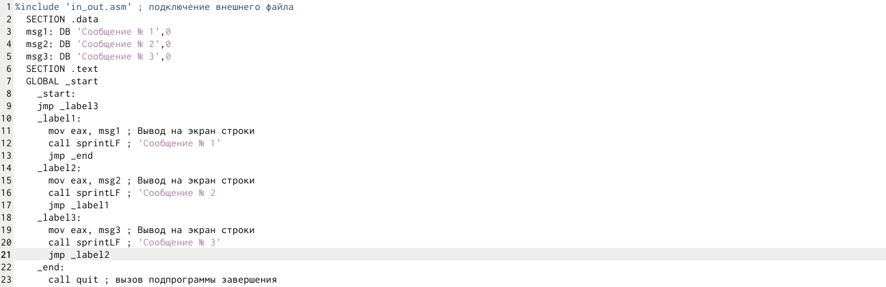{#fig:005 width=70%}

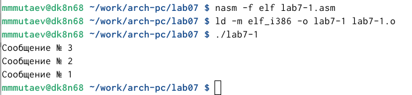{#fig:006 width=70%}

## Знакомство с условным переходом

Я создал новый файл lab7-2.asm и закинул туда код из листинга 7.3

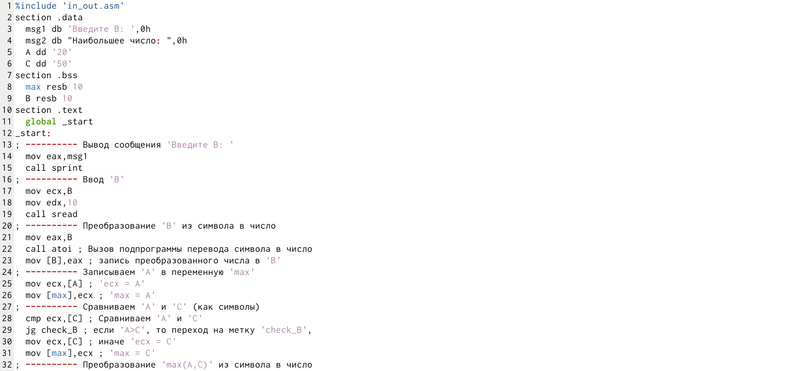{#fig:007 width=70%}

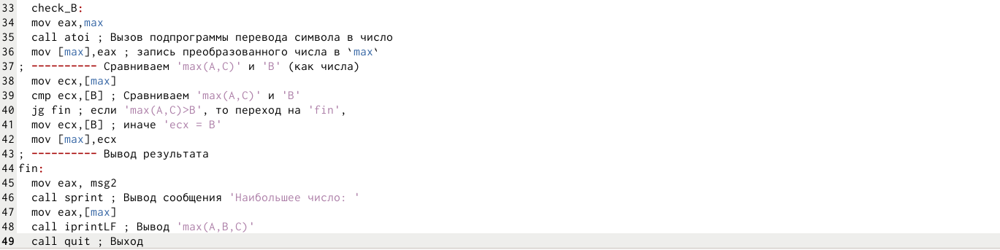{#fig:008 width=70%}

Программа выдавала такой результат (рис. [-@fig:009]).

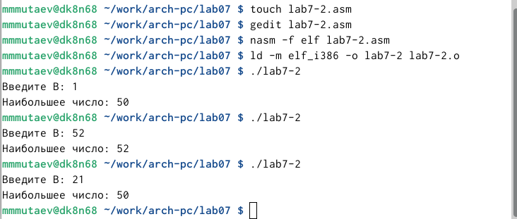{#fig:009 width=70%}

Программа выявляла максимальное число из A, B и C, где В вводится с клавиатуры

## Файлы листинга

Я создал листинг асм файла с помощью команды nasm -f elf -l lab7-2.lst lab7-2.asm и зашел туда (рис. [-@fig:010]).

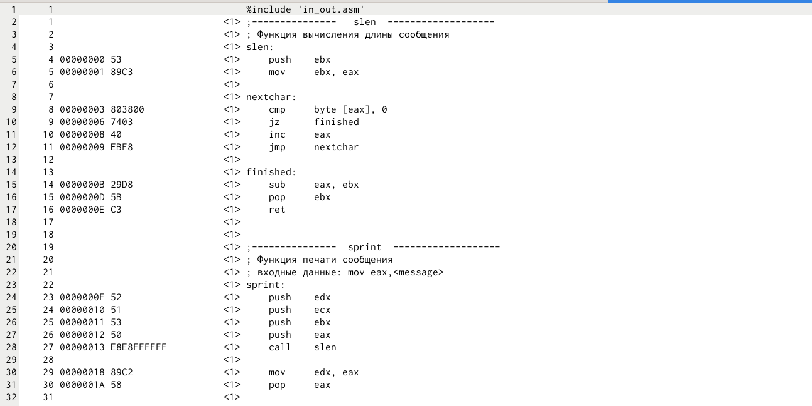{#fig:010 width=70%}

Мне нужно объяснить содержимое 3 любых строк в файле. Воспользуемся рандомайзером (рис. [-@fig:011])

{#fig:011 width=70%}

Приступим к анализу: во всех строках понятно, что первое число - это номер строки листинга, второе - смещение машинного кода от начала текущего сегмента, 3 число - машинный код, представляющий собой ассемблированную исходную строку в виде шестнадцатеричной последовательности, а 4 блок - текст кода. Рассмотрим именно его

{#fig:012 width=70%}

*sub eax, ebx* - это команда для операции eax - ebx, результат которой запишется в eax

{#fig:013 width=70%}

*add eax, ebx* - это команда для операции eax + ebx, результат которой запишется в eax

{#fig:014 width=70%}

*mov eax, max* - это команда для присвоения eax значения max

Теперь попробуем из любой инструкции с 2 операндами удалить 1 из них. Так я удалил операнд B из строки 21 (рис. [-@fig:015]):

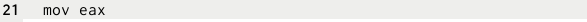{#fig:015 width=70%}

Как и ожидалось, у меня просто не получилось создать файл листинга (рис. [-@fig:016]):

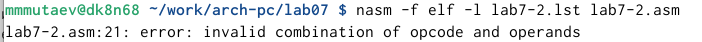{#fig:016 width=70%}

## Задания для самостоятельной работы

1. Напишите программу нахождения наименьшей из 3 целочисленных переменных *a, b* и *c*. Значения переменных выбрать из табл. 7.5 в соответствии с вариантом, полученным при выполнении лабораторной работы № 7. Создайте исполняемый файл и проверьте его работу

Я написал вот такой код (рис. [-@fig:017]):

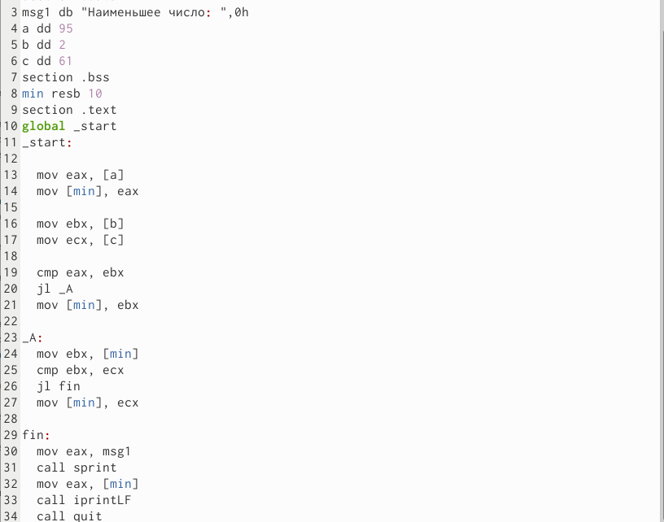{#fig:017 width=70%}

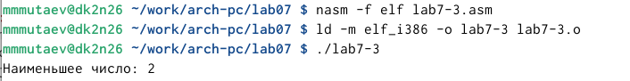{#fig:018 width=70%}

1. Напишите программу, которая для введенных с клавиатуры значений x и a вычисляет значение заданной функции f(x) и выводит результат вычислений. Вид функции f(x) выбрать из таблицы 7.6 вариантов заданий в соответствии с вариантом, полученным при выполнении лабораторной работы № 7. Создайте исполняемый файл и проверьте его работу для значений x и a из 7.6

Я написал следующий код (рис. [-@fig:019]):

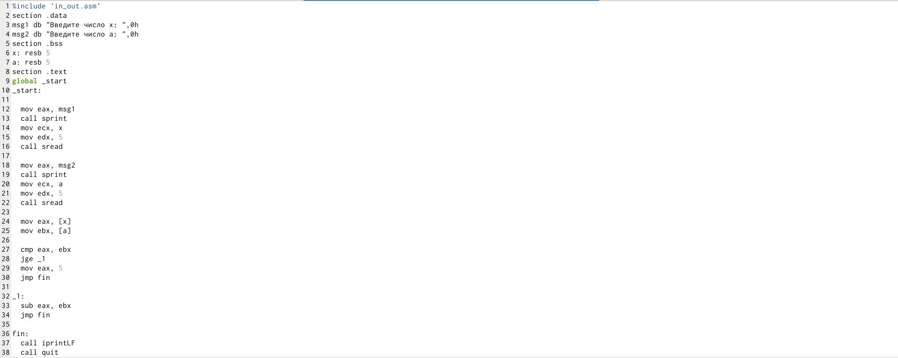{#fig:019 width=70%}

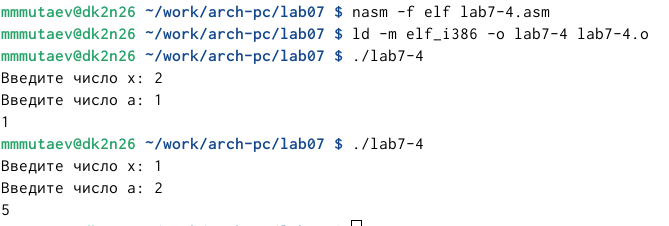{#fig:020 width=70%}

# Выводы

Я изучил команды условного и безусловного переходов и приобрел навыки написания программ с использованием переходов, а также познакомился с назначением и структурой файла листинга

