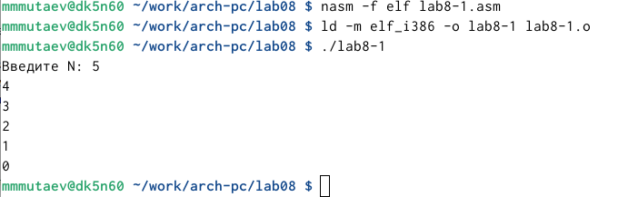

---
## Front matter
title: "Отчет по лабораторной работе №8"
subtitle: "Дисциплина: Архитектура компьютера"
author: "Мутаев Муртазаали Магомедович"

## Generic otions
lang: ru-RU
toc-title: "Содержание"

## Bibliography
bibliography: bib/cite.bib
csl: pandoc/csl/gost-r-7-0-5-2008-numeric.csl

## Pdf output format
toc: true # Table of contents
toc-depth: 2
lof: true # List of figures
lot: true # List of tables
fontsize: 12pt
linestretch: 1.5
papersize: a4
documentclass: scrreprt
## I18n polyglossia
polyglossia-lang:
  name: russian
  options:
	- spelling=modern
	- babelshorthands=true
polyglossia-otherlangs:
  name: english
## I18n babel
babel-lang: russian
babel-otherlangs: english
## Fonts
mainfont: IBM Plex Serif
romanfont: IBM Plex Serif
sansfont: IBM Plex Sans
monofont: IBM Plex Mono
mathfont: STIX Two Math
mainfontoptions: Ligatures=Common,Ligatures=TeX,Scale=0.94
romanfontoptions: Ligatures=Common,Ligatures=TeX,Scale=0.94
sansfontoptions: Ligatures=Common,Ligatures=TeX,Scale=MatchLowercase,Scale=0.94
monofontoptions: Scale=MatchLowercase,Scale=0.94,FakeStretch=0.9
mathfontoptions:
## Biblatex
biblatex: true
biblio-style: "gost-numeric"
biblatexoptions:
  - parentracker=true
  - backend=biber
  - hyperref=auto
  - language=auto
  - autolang=other*
  - citestyle=gost-numeric
## Pandoc-crossref LaTeX customization
figureTitle: "Рис."
tableTitle: "Таблица"
listingTitle: "Листинг"
lofTitle: "Список иллюстраций"
lotTitle: "Список таблиц"
lolTitle: "Листинги"
## Misc options
indent: true
header-includes:
  - \usepackage{indentfirst}
  - \usepackage{float} # keep figures where there are in the text
  - \floatplacement{figure}{H} # keep figures where there are in the text
---

# Цель работы

Приобретение навыков написания программ с использованием циклов и обработкой аргументов командной строки.

# Задание

1. Реализация циклов NASM
1. Обработка аргументов командной строки
1. Задание для самостоятельной работы

# Выполнение лабораторной работы

## Реализация циклов NASM

Я создал каталог для программам лабораторной работы № 8, перешел в него и создал файл lab8-1.asm. Далее ввел текст программы из Листинга 8.1, создал исполняемый файл и запустил его:

{#fig:001 width=70%}

{#fig:002 width=70%}

Программа выводит значения регистра ecx. Его значение уменьшается на 1 с каждым проходом цикла.

Добавим в тело цикла уменьшение ecx и проверим работу программы:

{#fig:003 width=70%}

{#fig:004 width=70%}

 
{#fig:005 width=70%}

Для использования регистра ecx в цикле и сохранения корректности работы программы можно использовать стек. Внесем изменения в текст программы, добавив команды push и pop (добавления в стек и извлечения из стека) для сохранения значения счетчика цикла loop:

{#fig:006 width=70%}

В результате программа выдала мне значение (ecx-1), но в данном случае количество проходов цикла соответствует введенному числу N.

{#fig:007 width=70%}

## Обработка аргументов командной строки

При разработке программ иногда встает необходимость указывать аргументы, которые будут использоваться в программе, непосредственно из командной строки при запуске программы.
При запуске программы в NASM аргументы командной строки загружаются в стек в обратном порядке, кроме того в стек записывается имя программы и общее количество аргументов. Последние два элемента стека для программы, скомпилированной NASM, – это всегда имя программы и количество переданных аргументов.
Таким образом, для того чтобы использовать аргументы в программе, их просто нужно извлечь из стека. Обработку аргументов нужно проводить в цикле. Т.е. сначала нужно извлечь из стека количество аргументов, а затем циклично для каждого аргумента выполнить логику программы. В качестве примера рассмотрим программу из Листинга 8.2, которая выводит на экран аргументы командной строки:

{#fig:008 width=70%}

После запустил программу, введя *./lab8-2 аргумент1 аргумент 2 'аргумент 3'*. Мне выдало следующий результат:

{#fig:009 width=70%}

Таким образом программа обработала 4 аргумента. 

Рассмотрим еще один пример программы которая выводит сумму чисел, которые передаются в программу как аргументы. Для этого создадим файл lab8-3.asm и введем туда текст из Листинга 8.3:

{#fig:010 width=70%}

В результате программа выводит нам сумму введенных чисел:

{#fig:011 width=70%}

Теперь попробуем самостоятельно изменить текст программы так, чтобы в результате у нас выводилось произведение введенных чисел. Для этого я первоначально присвоил esi значение 1, чтобы при умножении числа результат не обнулялся. После этого заменил строку *add esi, eax* на 2 строки:

*mul esi*

*mov esi, eax*

Т.е. я сначала умножил еах на esi, а потом присвоил esi значение еах.

{#fig:012 width=70%}

{#fig:013 width=70%}

## Задание для самостоятельной работы

Напишите программу, которая находит сумму значений функции *f(x)* для *x = x1, x2, ..., xn*, т.е. программа должна выводить значение *f(x1) + f(x2) + ... + f(xn)*. Значения *xi* передаются как аргументы. Вид функции *f(x)* выбрать из таблицы 8.1 вариантов заданий в соответствии с вариантом, полученным при выполнении лабораторной работы № 7. Создайте исполняемый файл и проверьте его работу на нескольких наборах *x* = *x1, x2, ..., xn*.

Возьмем за основу программу для нахождения суммы аргументов. Вытаскивая каждый аргумент из стека, отредактируем их в соответствии с функцией, т.е. подставим их вместо *х*, и уже измененные значения будем добавлять в переменную *esi*. Вот программа, которая у меня получилась:

{#fig:014 width=70%}

И вот наш результат:

{#fig:015 width=70%}

# Выводы

Я приобрел навыки написания программ с использованием циклов и обработкой аргументов командной строки.

