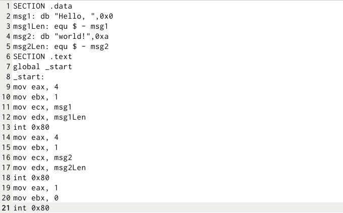
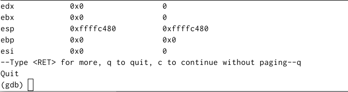

---
## Front matter
title: "Отчет по лабораторной работе №9"
subtitle: "Дисциплина: Архитектура компьютера"
author: "Мутаев Муртазаали Магомедович"

## Generic otions
lang: ru-RU
toc-title: "Содержание"

## Bibliography
bibliography: bib/cite.bib
csl: pandoc/csl/gost-r-7-0-5-2008-numeric.csl

## Pdf output format
toc: true # Table of contents
toc-depth: 2
lof: true # List of figures
lot: true # List of tables
fontsize: 12pt
linestretch: 1.5
papersize: a4
documentclass: scrreprt
## I18n polyglossia
polyglossia-lang:
  name: russian
  options:
	- spelling=modern
	- babelshorthands=true
polyglossia-otherlangs:
  name: english
## I18n babel
babel-lang: russian
babel-otherlangs: english
## Fonts
mainfont: IBM Plex Serif
romanfont: IBM Plex Serif
sansfont: IBM Plex Sans
monofont: IBM Plex Mono
mathfont: STIX Two Math
mainfontoptions: Ligatures=Common,Ligatures=TeX,Scale=0.94
romanfontoptions: Ligatures=Common,Ligatures=TeX,Scale=0.94
sansfontoptions: Ligatures=Common,Ligatures=TeX,Scale=MatchLowercase,Scale=0.94
monofontoptions: Scale=MatchLowercase,Scale=0.94,FakeStretch=0.9
mathfontoptions:
## Biblatex
biblatex: true
biblio-style: "gost-numeric"
biblatexoptions:
  - parentracker=true
  - backend=biber
  - hyperref=auto
  - language=auto
  - autolang=other*
  - citestyle=gost-numeric
## Pandoc-crossref LaTeX customization
figureTitle: "Рис."
tableTitle: "Таблица"
listingTitle: "Листинг"
lofTitle: "Список иллюстраций"
lotTitle: "Список таблиц"
lolTitle: "Листинги"
## Misc options
indent: true
header-includes:
  - \usepackage{indentfirst}
  - \usepackage{float} # keep figures where there are in the text
  - \floatplacement{figure}{H} # keep figures where there are in the text
---

# Цель работы

Приобретение навыков написания программ с использованием подпрограмм. Знакомство с методами отладки при помощи GDB и его основными возможностями.

# Задание

1. Реализация подпрограмм в NASM
1. Отладка программ с помощью GDB
   1. Работа с данными программы в GDB
   1. Обработка аргументов командной строки в GDB
1. Задания для самостоятельной работы

# Выполнение лабораторной работы

## Реализация подпрограмм в NASM

По базе сначала создаем файл lab9-1.asm в каталоге work/arch-pc/lab09

В качестве примера рассмотрим программу вычисления арифметического выражения *f(x) = 2x + 7* с помощью подпрограммы _calcul. В данном примере x вводится с клавиатуры, а само выражение вычисляется в подпрограмме. Воспользуемся кодом из Листинга 9.1  (рис. [-@fig:001]):

{#fig:001 width=70%}

Вот такой результат у меня получился (рис. [-@fig:002]):

{#fig:002 width=70%}

Попробуем изменить текст программы, добавив подпрограмму _subcalcul в подпрограмму _calcul, для вычисления выражения f(g(x)), где x вводится с клавиатуры, f(x) = 2x + 7, g(x) = 3x − 1. Т.е. x передается в подпрограмму _calcul из нее в подпрограмму _subcalcul, где вычисляется выражение g(x), результат возвращается в _calcul и вычисляется выражение f(g(x)). Результат возвращается в основную программу для вывода результата на экран.

Вот такая программа у меня получилась (рис. [-@fig:003]):

{#fig:003 width=70%}

У меня получился такой результат (рис. [-@fig:004]):

{#fig:004 width=70%}

Как мы видим, результат получился верным, значит программа написана правильно.

## Отладка программ с помощью GDB

Воспользуемся кодом из Листинга 9.2 (программы для вывода Hello world!) (рис. [-@fig:005]):

{#fig:005 width=70%}

Для работы с GDB в исполняемый файл необходимо добавить отладочную информацию, для этого трансляцию программ необходимо проводить с ключом ‘-g’. После этого я загрузил исполняемый файл в отладчик gdb и запустил его (рис. [-@fig:006]):

{#fig:006 width=70%}

Для более подробного анализа программы установим брейкпоинт на метку _start, с которой начинается выполнение любой ассемблерной программы, и запустим её (рис. [-@fig:007]):

{#fig:007 width=70%}

Далее просмотрим дисассимилированный код программы с помощью команды disassemble начиная с метки _start (рис. [-@fig:008]):

{#fig:008 width=70%}

Переключимся на отображение команд с Intel’овским синтаксисом, введя команду set disassembly-flavor intel (рис. [-@fig:009]):

{#fig:009 width=70%}

Есть некоторые различия в отображениях в этих режимах, а именно в виде колонки с текстом программы: в ATT'e она выглядит, как *"$0x{операнд},%{регистер}"*, а в Intel - *"{регистер},0х{операнд}"*

Теперь включим режим псевдографики для более удобного анализа программы:

{#fig:010 width=70%}

{#fig:011 width=70%}

Установить точку останова можно командой break (кратко b). Типичный аргумент этой команды — место установки. Его можно задать или как номер строки программы (имеет смысл, если есть исходный файл, а программа компилировалась с информацией об отладке), или как имя метки, или как адрес. Чтобы не было путаницы с номерами, перед адресом ставится «звёздочка».

На предыдущих шагах была установлена точка останова по имени метки (_start). Проверим это с помощью команды info breakpoints (кратко i b) (рис. [-@fig:012]):

{#fig:012 width=70%}

Установим еще одну точку останова по адресу инструкции. Адрес инструкции можно увидеть в средней части экрана в левом столбце соответствующей инструкции

Определим адрес предпоследней инструкции (mov ebx,0x0) и установим точку останова (рис. [-@fig:013]):

{#fig:013 width=70%}

Адрес инструкции находился в средней части экрана в левом столбце соответствующей инструкции. Можно заметить, что слева от адреса появился значок *b+*. Вероятно он означает, что здесь поставлен брейкпоинт.

Теперь снова посмотрим информацию о всех установленных точках останова (рис. [-@fig:014]):

{#fig:014 width=70%}

Как мы видим, информация обновилась.

### Работа с данными программы в GDB

Отладчик может показывать содержимое ячеек памяти и регистров, а при необходимости позволяет вручную изменять значения регистров и переменных. Посмотрим содержимое регистров также можно с помощью команды info registers (рис. [-@fig:015]):

{#fig:015 width=70%}

Для отображения содержимого памяти можно использовать команду x <адрес>, которая выдаёт содержимое ячейки памяти по указанному адресу. Формат, в котором выводятся данные, можно задать после имени команды через косую черту: x/NFU <адрес>. С помощью команды x &<имя переменной> также можно посмотреть содержимое переменной. Посмотрим значение перменной msg1 по имени (рис. [-@fig:016]):

{#fig:016 width=70%}

Посмотрим значение переменной msg2 по адресу. Адрес переменной можно определить по дизассемблированной инструкции. Посмотрите инструкцию mov ecx,msg2 которая записывает в регистр ecx адрес перемененной msg2 (рис. [-@fig:017]):

{#fig:017 width=70%}

Изменить значение для регистра или ячейки памяти можно с помощью команды set, задав ей в качестве аргумента имя регистра или адрес. При этом перед именем регистра ставится префикс $, а перед адресом нужно указать в фигурных скобках тип данных (размер сохраняемого значения; в качестве типа данных можно использовать типы языка Си).

Изменим первый символ переменной msg1 (рис. [-@fig:018]):

{#fig:018 width=70%}

Заменим любой символ в переменной msg2 (рис. [-@fig:019]):

{#fig:019 width=70%}

Поздравляю, теперь наша программа задает вопрос "hello, World?"

Далее изменим значение регистра ebx и выведемОбработка аргументов командной строки в GDB его значение с помощью print (рис. [-@fig:020]):

{#fig:020 width=70%}

Можно заметить разницу, в зависимости от введенного значения. В первом случае мы в ebx записываем символ "2", поэтому принт выводит номер этого символа в таблице ASCII, а во втором случае мы присваеваем ebx значение 2, поэтому он выводит 2.

### Обработка аргументов командной строки в GDB

Скопируем файл lab8-2.asm в нашу папку и назовем ее lab09-3.asm. Создадим исполняемый файл и загрузим в gdb программу. Для загрузки в gdb программы с аргументами необходимо использовать ключ --args (рис. [-@fig:021]):

{#fig:021 width=70%}

Как отмечалось в предыдущей лабораторной работе, при запуске программы аргументы командной строки загружаются в стек. Исследуем расположение аргументов командной строки в стеке после запуска программы с помощью gdb. Адрес вершины стека храниться в регистре esp и по этому адресу располагается число равное количеству аргументов командной строки (рис. [-@fig:022])

Как видно, число аргументов равно 5 – это имя программы lab09-3 и непосредственно аргументы: аргумент1, аргумент, 2 и 'аргумент 3'. Посмотрим остальные позиции стека – по адесу [esp+4] располагается адрес в памяти где находиться имя программы, по адесу [esp+8] храниться адрес первого аргумента, по адресу [esp+12] – второго и т.д

{#fig:022 width=70%}

Предполагаю, что шаг изменения адреса равен 4, потому что на каждый аргумент выделено 4 байта.

## Задания для самостоятельной работы

1. Преобразуйте программу из лабораторной работы №8 (Задание №1 для самостоятельной работы), реализовав вычисление значения функции f(x) как подпрограмму.

Легко! Просто переносим часть с нахождением значения f(x) в подпрограмму. Вот код, который у меня получился (рис. [-@fig:023]):

{#fig:023 width=70%}

А вот результат (рис. [-@fig:024]):

{#fig:024 width=70%}

2. В листинге 9.3 приведена программа вычисления выражения (3 + 2) ∗ 4 + 5. При запуске данная программа дает неверный результат. Проверьте это. С помощью отладчика GDB, анализируя изменения значений регистров, определите ошибку и исправьте ее.

Ответ действительно неправильный: программа должна выводить 25, а выводит 10

{#fig:025 width=70%}

Так как в результат записывается значение регистра ebx, отследим его изменение и изменение других регистров. Изначально ebx = 3

{#fig:026 width=70%}

Далее мы прибавили к ebx eax, и у нас ebx = 5 

{#fig:027 width=70%}

Далее мы присвоили ecx значение 4 и умножили eax на ecx. Возможно, в этом и есть ошибка

{#fig:028 width=70%}

Далее к ebx прибавили 5 (теперь ebx = 10) и записали его значение в edi

{#fig:029 width=70%}

Пошагово проанализировав изменение значений регистров, я выяснил, что ошибкой является то, что мы умножили eax на 4, а должны были ebx. Попытаемся исправить эту ошибку. Вот такая программа у меня получилась (рис. [-@fig:030]):

{#fig:030 width=70%}

И вот такой результат (рис. [-@fig:031]):

{#fig:031 width=70%}

# Выводы

Я приобрел навыки написания программ с использованием подпрограмм и познакомился с методами отладки при помощи GDB и его основными возможностями.

