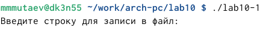
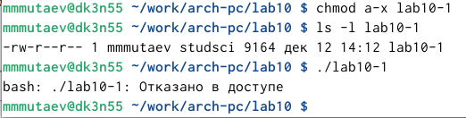
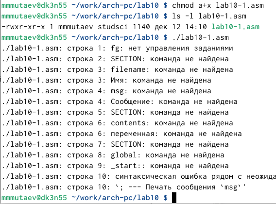
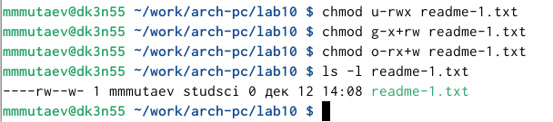
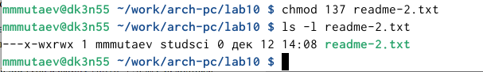
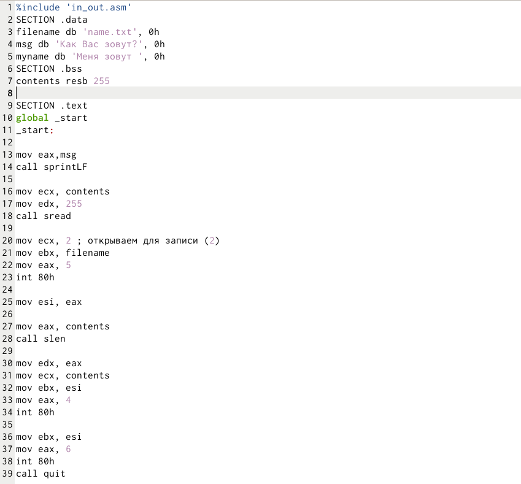
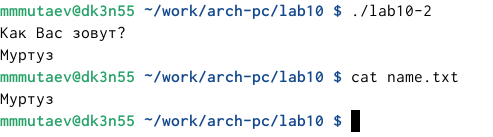

---
## Front matter
title: "Отчет по лабораторной работе №10"
subtitle: "Дисциплина: Архитектура компьютера"
author: "Мутаев Муртазаали Магомедович"

## Generic otions
lang: ru-RU
toc-title: "Содержание"

## Bibliography
bibliography: bib/cite.bib
csl: pandoc/csl/gost-r-7-0-5-2008-numeric.csl

## Pdf output format
toc: true # Table of contents
toc-depth: 2
lof: true # List of figures
lot: true # List of tables
fontsize: 12pt
linestretch: 1.5
papersize: a4
documentclass: scrreprt
## I18n polyglossia
polyglossia-lang:
  name: russian
  options:
	- spelling=modern
	- babelshorthands=true
polyglossia-otherlangs:
  name: english
## I18n babel
babel-lang: russian
babel-otherlangs: english
## Fonts
mainfont: IBM Plex Serif
romanfont: IBM Plex Serif
sansfont: IBM Plex Sans
monofont: IBM Plex Mono
mathfont: STIX Two Math
mainfontoptions: Ligatures=Common,Ligatures=TeX,Scale=0.94
romanfontoptions: Ligatures=Common,Ligatures=TeX,Scale=0.94
sansfontoptions: Ligatures=Common,Ligatures=TeX,Scale=MatchLowercase,Scale=0.94
monofontoptions: Scale=MatchLowercase,Scale=0.94,FakeStretch=0.9
mathfontoptions:
## Biblatex
biblatex: true
biblio-style: "gost-numeric"
biblatexoptions:
  - parentracker=true
  - backend=biber
  - hyperref=auto
  - language=auto
  - autolang=other*
  - citestyle=gost-numeric
## Pandoc-crossref LaTeX customization
figureTitle: "Рис."
tableTitle: "Таблица"
listingTitle: "Листинг"
lofTitle: "Список иллюстраций"
lotTitle: "Список таблиц"
lolTitle: "Листинги"
## Misc options
indent: true
header-includes:
  - \usepackage{indentfirst}
  - \usepackage{float} # keep figures where there are in the text
  - \floatplacement{figure}{H} # keep figures where there are in the text
---

# Цель работы

Приобретение навыков написания программ для работы с файлами.

# Задание

1. Изменение доступа к файлам
1. Задание для самостоятельной работы

# Выполнение лабораторной работы

## Изменение доступа к файлам

Создаем файлы lab10-1.asm, readme-1.txt и readme-2.txt в каталоге ~/work/arch-pc/lab10

Вставим в файл lab10-1.asm код из Листинга 10.1 (программа записи в файл сообщения) и создадим исполняемый файл

Запустив программу, мне дали ввести строку для записи в файл (рис. [-@fig:001]):

{#fig:001 width=70%}

Я ввел строку, и по сути она должна записаться в файл readme.txt.

Изменим доступ к файлу. Запретим себе исполнение файла с помощью команды chmod (рис. [-@fig:002]):

{#fig:002 width=70%}

Как мы видим, при попытке запуска программы мне написало, что в доступе отказано. Очевидно, что это из-за того, что я только что запретил себе запуск программы. Также это можно заметить в результате *ls -l lab10-1*: там у меня доступ только к read и write (rw)

Довольно с ограничениями, дадим себе доступ к исполнению файла lab10-1.asm (рис. [-@fig:003]):

{#fig:003 width=70%}

Как мы видим, теперь у нас есть доступ к исполнению asm файла.

В соответствии с вариантом в таблице 10.4 предоставим права доступа к файлу readme-1.txt представленные в символьном виде, а для файла readme-2.txt – в двочном виде. Проверим правильность выполнения с помощью команды ls -l.

Просто по очереди предоставляем и забираем права у каждой группы каждого файла

{#fig:004 width=70%}

{#fig:005 width=70%}

## Задание для самостоятельной работы

Я написал вот такой код (рис. [-@fig:006]):

{#fig:006 width=70%}

И у меня получился такой результат (также я проверил его в файле с помощью команды cat) (рис. [-@fig:007]):

{#fig:007 width=70%}

# Выводы

Я приобрел навыки написания программ для работы с файлами. 

